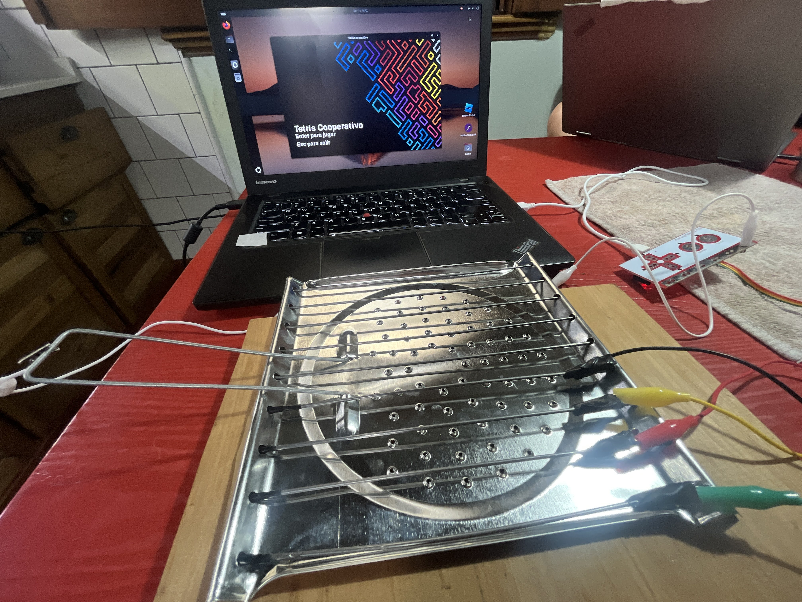

# TostaTetris  
**Tetris on Toast - A Collaborative Experiment**  


#### 🎞️ WATCH THE VIDEO!  [TostaTetris in Action!](https://drive.google.com/file/d/1NZAoAppYuWcub61zGuiiNpOEzgXBRsrT/view?usp=sharing)  🎞️




TostaTetris combines programming, creativity, and the reuse of everyday objects to create a collaborative and playful gaming experience. Using **Python with Pygame** and a **Makey Makey**, this project introduces a cooperative version of the classic Tetris game.  

The **Makey Makey**, a device that transforms almost any object into an interactive controller, was integrated into an **old toaster**. The metal elements of the toaster were repurposed as touch-sensitive controls. By touching these metallic parts, two players can share the same screen and collaborate to play Tetris together.  

This project explores themes of **collaboration**, **recycling**, and **hands-on interaction**. By combining physical objects with digital gameplay, Tostatetris invites participants to engage in a fun and accessible experience that reimagines how we play games and interact with everyday objects.  

---

## Watch Tostatetris in Action

https://github.com/vlasvlasvlas/tostatetris/blob/main/media/tostatetris-game-1.mp4

https://github.com/vlasvlasvlas/tostatetris/blob/main/media/tostatetris-game-2.mp4


---

## Genre  
**Collaborative Interactive Game, Experimental Play Installation**  

---

## Materials Needed  
To set up and play Tostatetris, you’ll need:  
1. A **Makey Makey** (or compatible device).  
2. An **adapted toaster** with metallic parts configured as touch-sensitive controls for the Makey Makey.  
3. The **Tostatetris game**, available for download from this repository: [python-tetris-collaborative](https://github.com/vlasvlasvlas/python-tetris-colaborative).  
   - The game can be run as a `.exe` file (if available in the repo) or directly using Python.  
4. A **PC with a monitor**.  
5. (Optional) A second player to enjoy the collaborative gameplay!  

---

## Installation and Setup  

1. Clone the repository:  
   ```bash
   git clone https://github.com/vlasvlasvlas/python-tetris-collaborative.git
   cd python-tetris-collaborative
   ```

2. **Run the game**:  
   - **Option 1:** Execute the `.exe` file (if available) directly from the repository.  
   - **Option 2:** Run the Python script:  
     - Ensure Python 3 is installed on your PC.  
     - Install dependencies:  
       ```bash
       pip install pygame
       ```
     - Run the game:  
       ```bash
       python tetris.py
       ```

3. Connect the **Makey Makey** to your PC.  
4. Attach the Makey Makey to the adapted toaster, ensuring the metallic elements are properly linked to the device’s inputs.  
5. Start the game and enjoy!  

---

## URL and Social Media  
Follow the project and updates:  
[Instagram Post](https://www.instagram.com/p/DDmf_GNOCWiImcdJpRexTr3deKa3saQhrpQExg0/)  

---
